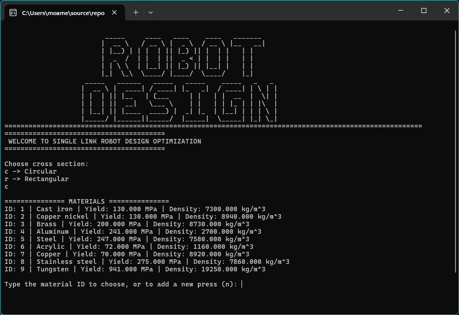
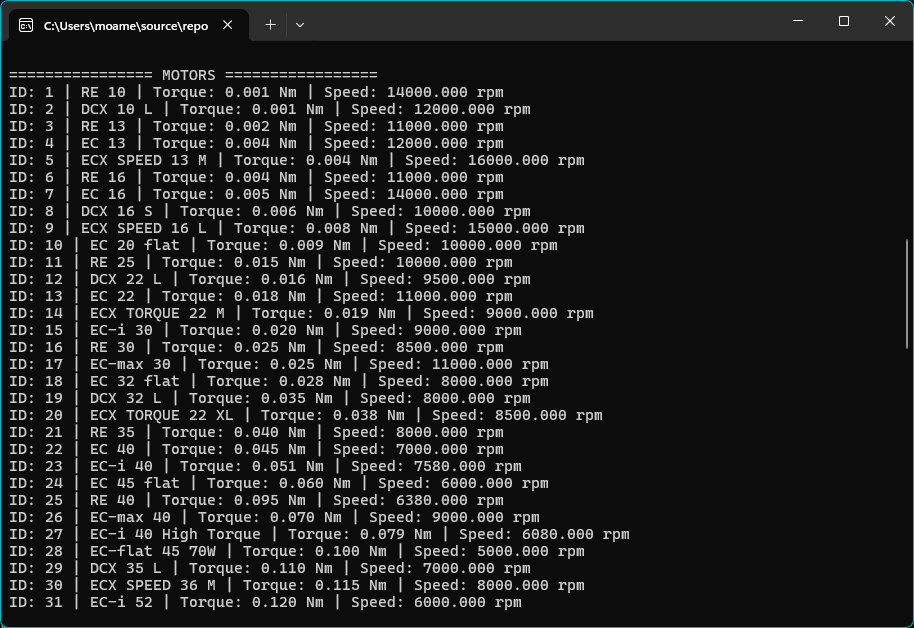
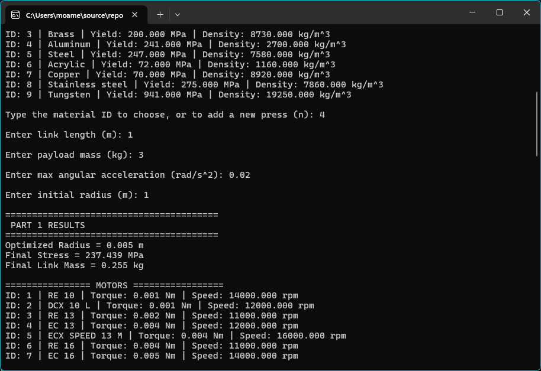

  

# ⚙️ CSE232 Motor & Gearbox Analysis Tool

**A console-based engineering application for motor selection, gearbox matching, and mechanical analysis of link systems.**

[Features](#-features) • [Installation](#-installation) • [Usage](#-usage) • [Technical Details](#-technical-details)

---

## 🌟 Features

### ⚙️ **Motor & Gearbox Selection**
- 🔍 Predefined database of motors and gearboxes  
- 🔗 Automatic motor–gearbox pairing  
- 📊 Torque and speed matching analysis  
- ✅ Feasibility validation based on system requirements  

### 📐 **Mechanical Analysis**
- 🧱 Link mass calculation (rectangular & circular cross-sections)  
- 📉 Bending moment computation  
- 📏 Moment of inertia calculations  
- ⚠️ Maximum stress evaluation  

### 🔢 **Engineering Calculations**
- ⚡ Required torque computation  
- 🔄 Output torque after gearbox  
- 🌀 Angular velocity calculations  
- 📊 Efficiency considerations  

### 🧠 **Smart Input Handling**
- ✅ Robust numeric validation  
- 🔁 Re-prompting on invalid input  
- 🧾 Clear console prompts

### 📸Screenshots

  

  

  

